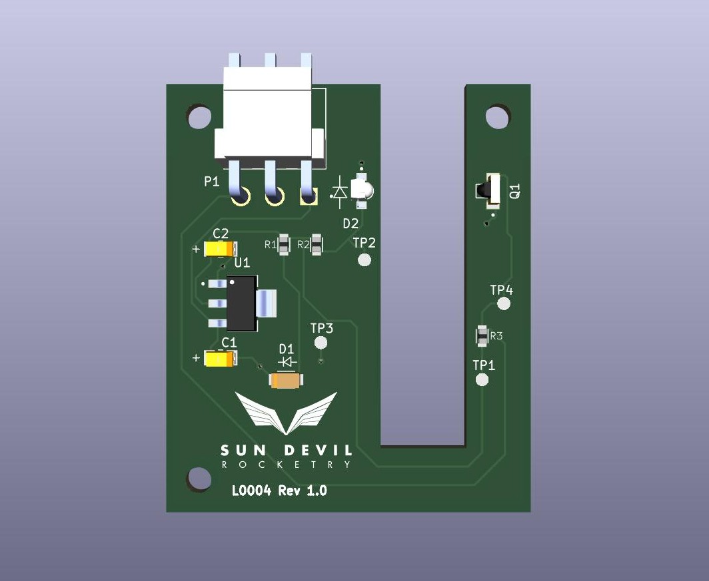
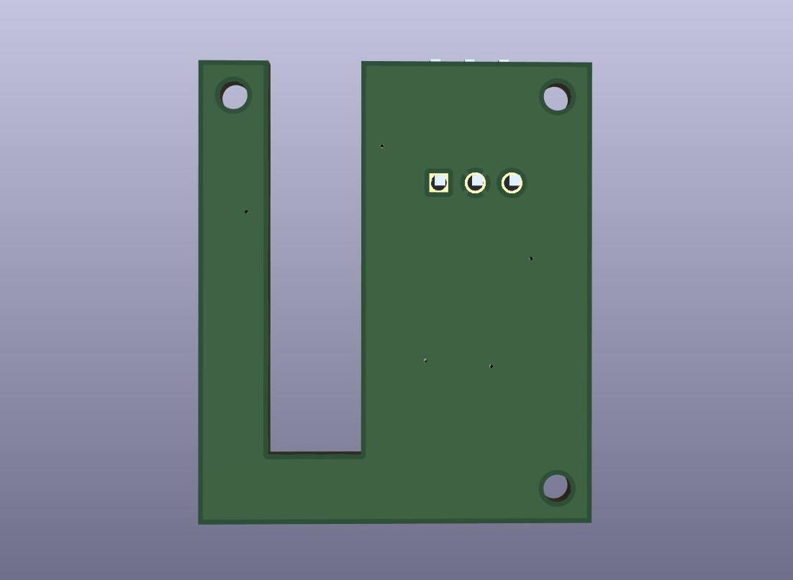
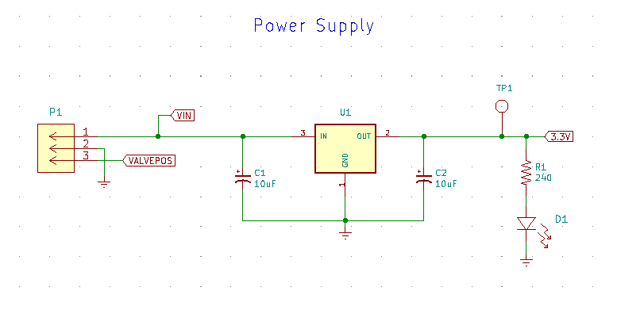
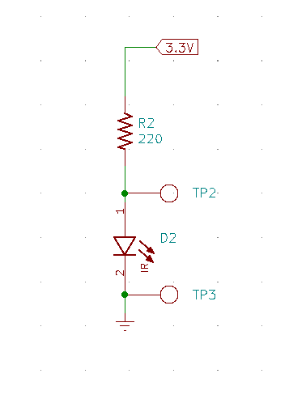
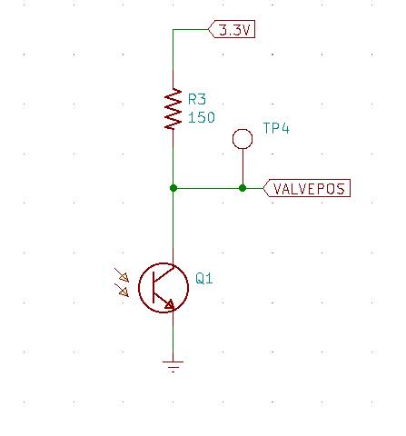

<h1>Photogate</h1>

Current PCB Revision: 1.0

PCB Part Number: L0004

The photogate board functions as an optical sensor for calibrating the absolute position of stepper motors upon controller startup (L0005). The photogate is mounted on the stepper motor adjacent to the motor shaft, which is coupled to the stem of a ball-valve used as the main propellant valve in SDR's liquid engine. The photogate uses an infrared LED to produce an optical signal on the infrared-sensitive phototransistor surface. The board has a characteristic U-shape that allows a small standoff strut on the motor coupler to block the optical path of the sensor when the valve reaches the closed position. 

<b>Working Directory Structure:</b>

   doc: documentation
   
   src: source design files, e.g. schematic and PCB layout files

   lib: libraries for schematic symbols and footprints

   production: files needed for pcb fabrication, e.g. gerbers, profile, drill file

   sim: simulation models/files 

   cad: 3d models
  
   img: images of circuit/footprints for github display 

<h2>3D Model: </h2>

<h2>Schematic: </h2>

<h3>Power Supply </h3>

<h3>Emitter</h3>

<h3>Sensor</h3>

